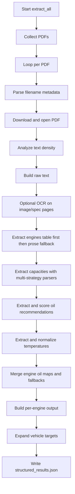

# Vehicle Manual Oil Spec Extractor

This repository extracts engine-oil specifications from vehicle manuals and exports normalized data for downstream use.

The main extraction script combines regex parsing, context filtering, table-aware logic, and selective OCR to recover:

- vehicle metadata (year, make, model)
- engine variants (for example, 2.0L Turbo, 3.5L V6)
- oil capacities (with/without filter)
- oil viscosity recommendations (primary/secondary)
- temperature conditions linked to recommendations

## Project Scripts

- `reader.py`: Main extractor. Produces structured JSON output.
- `migrate_to_sqlite.py`: Flattens JSON output into a SQLite table.
- `json_to_excel.py`: Flattens JSON output into an Excel workbook.
- `sort_pdf.py`: Utility script for sorting/copying manual files.

## Prerequisites

### 1. System

Install Tesseract OCR (required for scanned or image-heavy manuals):

- macOS: `brew install tesseract`
- Ubuntu/Debian: `sudo apt-get install tesseract-ocr`
- Windows: install Tesseract from UB-Mannheim builds

### 2. Python Dependencies

```bash
pip install PyMuPDF Pillow pytesseract google-api-python-client google-auth
```

## Configuration

Main runtime values are defined at the top of `reader.py`.

- `OUTPUT_FILE`: output JSON filename (default: `structured_results.json`)
- `REFERENCE_FILE`: optional make/model + engine-family normalization reference

`vehicle_reference.json` is optional but recommended for better make/model and engine-family normalization.

## Usage

Run extraction:

```bash
python reader.py
```

Convert JSON to SQLite:

```bash
python migrate_to_sqlite.py
```

Convert JSON to Excel:

```bash
python json_to_excel.py
```

## Troubleshooting

### Common OCR Issues

- `pytesseract.pytesseract.TesseractNotFoundError`:
    - Tesseract is not installed or not in PATH.
    - Install Tesseract and restart your terminal/IDE.
- OCR runs but extracted text looks empty/noisy:
    - Ensure the PDF pages are readable images (not extremely low resolution).
    - Re-run and check whether the script reports targeted/spec OCR activity.
- OCR is very slow:
    - This is expected for scanned manuals; image OCR is significantly slower than native-text extraction.

### Common Dependency Issues

- `ModuleNotFoundError: No module named 'fitz'`:
    - Install `PyMuPDF` in the same Python environment used to run the script.
- `ModuleNotFoundError: No module named 'PIL'`:
    - Install `Pillow`.
- `ModuleNotFoundError: No module named 'googleapiclient'` or `google.oauth2`:
    - Install `google-api-python-client` and `google-auth` (used by the configured source API client).

### Quick Verify Commands

```bash
python -c "import fitz, pytesseract, PIL; print('core imports ok')"
python -c "import googleapiclient, google.oauth2; print('google imports ok')"
tesseract --version
```

## Output Schema (High Level)

The extractor writes `structured_results.json` as:

```json
{
    "<source-file>": {
        "Vehicle": {
            "year": 2020,
            "make": "Ford",
            "model": "Escape",
            "engine_types": ["I4", "TURBO"],
            "displayName": "2020 Ford Escape"
        },
        "engines": {
            "2.0L Turbo": {
                "oil_capacity": {
                    "with_filter": {"quarts": 5.7, "liters": 5.4},
                    "without_filter": null
                },
                "oil_recommendations": [
                    {
                        "oil_type": "5W-30",
                        "recommendation_level": "primary",
                        "temperature_condition": ["all temperatures"]
                    }
                ]
            }
        }
    }
}
```

## Current Extraction Logic Summary

1. PDF text density check routes pages to direct text extraction and/or OCR.
2. Vehicle metadata is parsed from filename first, then repaired using document text and optional references.
3. Engine detection prioritizes structured/spec tables, then prose fallback.
4. Capacity extraction uses multiple targeted strategies before generic fallback scans.
    - Oil-service/top-up quantities are rejected dynamically when context says they are not total capacities.
5. Oil recommendations are scored from language strength (best/preferred/recommended/may be used) and context.
6. Temperature ranges are normalized and attached per oil recommendation when possible.
7. Final records are validated and normalized before JSON export.

## One-Page Flowchart Summary



## Step-by-Step: What The Code Does

This section follows the actual control flow in `reader.py` from `extract_all()`.

1. Startup and client creation
- Starts a timer.
- Creates the source API service client.
- Recursively collects all PDF entries to process.

2. Per-file loop begins
- Reads each source filename.
- Attempts metadata extraction from filename first (`year`, `make`, `model`).
- Downloads the PDF bytes and opens the document with PyMuPDF.

3. Document triage (text-heavy vs scan-heavy)
- Measures average extracted characters per page.
- Chooses `AUTO` for text-heavy documents.
- Chooses `MANUAL` for scan-heavy documents.

4. Metadata fallback repair
- If filename parsing is incomplete, scans early pages.
- Uses token ranking + optional reference matching to infer missing make/model/year.

5. Raw text build
- Extracts page text from all pages into one raw string.
- Keeps a cleaned version for prose matching.
- In `MANUAL` mode, OCRs image pages and appends OCR text.
- Runs targeted OCR on spec/capacity pages even when the document is text-heavy.

6. Engine extraction (priority order)
- Tries structured/spec table extraction first.
- Falls back to prose extraction if table extraction misses engines.
- Falls back again to variant labels from document-native model naming if needed.
- Filters out displacement outliers and consolidates duplicate variants.

7. Capacity extraction (multi-strategy)
- Runs strict oil-capacity section parser first.
- Merges model-named row tables and columnar model-capacity tables.
- Computes shared fallback capacity candidates.
- Uses guardrails to reject noisy tiny values or non-engine fluid rows.
- Rejects service/top-up quantities such as dipstick raise amounts, "do not use more than" limits, and between-service-interval oil amounts.
- Keeps only capacities aligned with detected engines when possible.

8. Engine list reconciliation
- Supplements detected engines when capacity rows provide trustworthy engine evidence.
- Removes engines that do not match trusted engine-capacity keys.

9. Oil recommendation extraction and scoring
- Normalizes OCR oil text.
- Removes oils in explicit "do not use" statements.
- Scores oil candidates across multiple passes:
- inline engine-oil mappings
- recommended/preferred/best phrases
- conditional "may be used" language
- wildcard classes (for example, SAE 0W-X where X is resolved)
- final proximity sweep

10. Temperature extraction and normalization
- Extracts Fahrenheit/Celsius values near oil statements.
- Converts Celsius to Fahrenheit.
- Normalizes into conditions such as `all temperatures`, `cold weather`, or explicit ranges.

11. Build oil-to-engine mapping
- Creates baseline proximity map.
- Overlays section-derived mappings.
- Overlays model-specific mappings.
- Overlays inline mappings (highest specificity).

12. Last-resort capacity fallback
- If no engine capacities are found, applies shared fallback capacity.
- If still empty, uses generic capacity pairing only as a final resort.

13. Capacity expansion and key alignment
- Expands `unknown_engine` shared capacity to detected engines when appropriate.
- Aligns capacity keys to richer detected variants (for example `2.0L Turbo`).
- Filters capacity records again to detected engine set.

14. Build final multi-engine data
- Combines capacities + oil recommendations into per-engine records.
- Normalizes quart values.
- Repairs `unknown_engine` when a clear best engine match exists.
- Applies shared capacity to noisy outputs when confidence is higher.
- Optionally appends missing layout token (for example `I4`) when unambiguous.

15. No-capacity fallback output
- If no robust multi-engine capacity map exists, builds oil-only engine records.
- Keeps primary/secondary oil ranking and temperature conditions.

16. Vehicle target expansion
- Detects model-specific "only" mentions and can emit multiple targets from one source file.
- Builds final result keys and vehicle display names.

17. Final serialization
- Writes the full `results` object to `structured_results.json`.
- Prints total runtime and completion message.

18. Optional downstream transforms
- `migrate_to_sqlite.py` converts structured JSON into flat SQLite rows.
- `json_to_excel.py` converts structured JSON into flat Excel rows.

## Function-by-Function Appendix (reader.py)

This appendix describes the major functions with:

- Inputs: key parameters
- Output: return value shape
- Why it exists: role in the pipeline

### Complete Inventory (All 120 Functions)

The list below is the full 1-to-1 function inventory from `reader.py` with direct links to each definition.

- [get_engine_displacement]
- [is_plausible_engine_displacement]
- [normalize_engine_type_token]
- [format_engine_variant_token]
- [normalize_cylinder_match]
- [find_engine_family_tokens]
- [extract_engine_variant_from_context]
- [normalize_engine_code_label]
- [extract_engine_code_labels]
- [engine_code_aliases]
- [has_engine_signal]
- [is_capacity_conversion_engine_match]
- [is_parenthesized_capacity_conversion]
- [is_capacity_or_fluid_row]
- [is_real_capacity_match]
- [match_sentence_context]
- [is_non_capacity_oil_quantity_match]
- [overlaps_real_capacity_match]
- [get_temperature_with_fallback]
- [has_non_engine_oil_context]
- [has_engine_oil_context]
- [score_oil_evidence]
- [extract_text_from_images]
- [extract_targeted_spec_ocr_text]
- [normalize_capacity_ocr_text]
- [capacity_from_ocr_numeric_text]
- [format_named_engine_variant]
- [extract_named_engine_variants_from_text]
- [match_application_to_named_engine]
- [extract_refill_application_engine_oil_capacities]
- [ocr_row_has_engine_oil_filter_label]
- [extract_image_table_engine_oil_capacity]
- [get_drive_service]
- [get_all_pdfs]
- [analyze_pdf_type]
- [download_pdf]
- [clean_text]
- [normalize_oil]
- [normalize_ocr_oil_text]
- [to_quarts_liters]
- [parse_filename]
- [build_multi_engine_data]
- [build_oil_only_engine_data]
- [expand_shared_capacity_to_detected_engines]
- [align_capacity_engine_keys_with_detected_variants]
- [filter_engine_caps_to_detected_engines]
- [add_capacity_backed_engine_candidates]
- [prefer_shared_capacity_if_current_caps_are_noise]
- [apply_shared_capacity_to_noisy_engine_data]
- [engine_label_has_type]
- [engine_label_has_layout]
- [select_single_layout_type]
- [is_layout_engine_type]
- [extract_layout_engine_tokens]
- [filter_engine_types_by_detected_engines]
- [add_missing_engine_type_to_keys]
- [build_capacity_record]
- [build_capacity_record_from_matches]
- [choose_preferred_capacity_match]
- [detect_capacity_field]
- [score_capacity_candidate]
- [extract_wildcard_oil_candidates]
- [extract_listed_oil_candidates]
- [select_best_capacity_candidates]
- [extract_ordered_engine_oil_capacity_from_text]
- [has_ambiguous_model_oil_capacity_table]
- [has_external_engine_oil_capacity_reference]
- [pair_quarts_liters]
- [load_vehicle_reference]
- [load_engine_family_reference]
- [normalize_vehicle_label]
- [compact_vehicle_label]
- [vehicle_filename_tokens]
- [filename_contains_vehicle_model]
- [strip_parenthetical_body_style]
- [canonicalize_engine_variant_label]
- [engine_identity_key]
- [match_model_label_to_detected_engine]
- [extract_oil_types_from_text]
- [cylinder_count_to_layout_token]
- [is_generic_manual_filename]
- [simplify_model_for_lookup]
- [is_make_suspicious]
- [is_known_make]
- [resolve_make_from_model_reference]
- [make_reference_patterns]
- [find_vehicle_mentions]
- [choose_primary_vehicle_mention]
- [extract_model_only_targets]
- [build_vehicle_output_targets]
- [extract_variant_engine_labels_from_pdf]
- [detect_vehicle_from_pdf]
- [map_oils_to_engines]
- [extract_engine_specific_oil_map]
- [extract_model_specific_oil_map]
- [extract_engines]
- [extract_engines_from_spec_table]
- [filter_engine_outliers]
- [consolidate_engine_variants]
- [has_engine_context]
- [extract_engine_types]
- [engine_matches_capacity]
- [extract_temperature]
- [normalize_capacity_value]
- [find_correct_engine_oil_capacities]
- [apply_correct_capacities]
- [extract_all_capacities_for_engine]
- [detect_all_engines_in_pdf]
- [fix_unknown_engine]
- [extract_engine_oil_capacity_sections]
- [extract_engine_capacities]
- [extract_columnar_model_capacity_table]
- [extract_model_named_capacity_tables]
- [extract_recommended_lubricants_capacity]
- [extract_explicit_shared_engine_oil_capacity]
- [extract_fallback_capacity]
- [merge_engine_cap_maps]
- [extract_oils]
- [select_best_engine]
- [extract_all]

### A. Entry Point and Source Access

- `extract_all()`
    - Inputs: none
    - Output: writes final JSON file; returns None
    - Why it exists: orchestrates the full extraction flow end to end.

- `get_drive_service()`
    - Inputs: none (uses configured credentials path and scopes)
    - Output: authenticated API client
    - Why it exists: creates the service client used to enumerate and download source PDFs.

- `get_all_pdfs(service, folder_id)`
    - Inputs: API service object, root folder identifier
    - Output: list of PDF file metadata objects
    - Why it exists: recursively discovers all PDF files to process.

- `download_pdf(service, file_id)`
    - Inputs: API service object, file id
    - Output: in-memory byte buffer
    - Why it exists: fetches each PDF into memory for parsing.

### B. Document Triage and OCR

- `analyze_pdf_type(doc)`
    - Inputs: PyMuPDF document
    - Output: tuple `(AUTO|MANUAL, avg_chars_per_page)`
    - Why it exists: decides whether OCR assistance is needed.

- `extract_text_from_images(doc, pages_with_images)`
    - Inputs: document and list of page numbers
    - Output: OCR text string
    - Why it exists: OCR fallback for image-heavy/manual pages.

- `extract_targeted_spec_ocr_text(doc)`
    - Inputs: document
    - Output: OCR text string for likely spec/capacity pages
    - Why it exists: recovers capacity-table text missed by normal extraction.

- `ocr_row_has_engine_oil_filter_label(text)`
    - Inputs: OCR row text
    - Output: boolean
    - Why it exists: robustly detects noisy OCR variants of engine-oil row labels.

- `normalize_capacity_ocr_text(text)`
    - Inputs: OCR text fragment
    - Output: normalized text
    - Why it exists: repairs OCR distortions before numeric parsing.

- `capacity_from_ocr_numeric_text(text)`
    - Inputs: OCR numeric text snippet
    - Output: capacity dict or None
    - Why it exists: extracts plausible oil quantity from OCR-only number cells.

- `extract_image_table_engine_oil_capacity(doc)`
    - Inputs: document
    - Output: capacity map
    - Why it exists: handles image-backed capacity tables by row detection + targeted OCR crops.

### C. Core Normalization Utilities

- `clean_text(text)`
    - Inputs: raw text
    - Output: whitespace-collapsed text
    - Why it exists: improves prose regex stability.

- `normalize_oil(raw)`
    - Inputs: oil string
    - Output: canonical oil grade (for example `5W-30`)
    - Why it exists: standard format for ranking and map merges.

- `normalize_ocr_oil_text(text)`
    - Inputs: OCR text
    - Output: corrected text
    - Why it exists: repairs common OCR confusion in oil grades.

- `to_quarts_liters(value, unit)`
    - Inputs: numeric value and unit token
    - Output: tuple `(quarts, liters)`
    - Why it exists: converts all capacities to a normalized dual-unit representation.

- `normalize_capacity_value(quarts_value)`
    - Inputs: quart value
    - Output: normalized numeric quart value
    - Why it exists: controls rounding noise in final output.

### D. Vehicle Metadata Resolution

- `parse_filename(name)`
    - Inputs: source filename
    - Output: tuple `(year, make, model)` with possible None values
    - Why it exists: fastest first-pass metadata extraction.

- `detect_vehicle_from_pdf(doc)`
    - Inputs: document
    - Output: tuple `(year, make, model)`
    - Why it exists: fallback when filename is generic/incomplete.

- `load_vehicle_reference()`
    - Inputs: none
    - Output: normalized make/model reference dict
    - Why it exists: optional reference-based repair for metadata accuracy.

- `load_engine_family_reference()`
    - Inputs: none
    - Output: engine family label list
    - Why it exists: supports variant token normalization (EcoBoost, etc.).

- `is_generic_manual_filename(stem)`
    - Inputs: filename stem
    - Output: boolean
    - Why it exists: prevents weak placeholder filenames from overriding PDF evidence.

- `resolve_make_from_model_reference(model, detected_make=None)`
    - Inputs: model text, optional detected make
    - Output: repaired make text
    - Why it exists: model-driven make correction when make text is suspicious.

- `find_vehicle_mentions(text, make_filter=None, reference=None)`
    - Inputs: text, optional make filter, optional reference
    - Output: ranked mention objects
    - Why it exists: detects explicit make/model mentions in prose.

- `choose_primary_vehicle_mention(mentions)`
    - Inputs: mention list
    - Output: selected mention or None
    - Why it exists: chooses best candidate when multiple mentions exist.

- `extract_model_only_targets(text, make=None, reference=None)`
    - Inputs: text plus optional make/reference
    - Output: model list
    - Why it exists: detects model-specific “only” targets for split output rows.

- `build_vehicle_output_targets(filename, raw_text, year, make, model)`
    - Inputs: filename, raw text, metadata fields
    - Output: list of output target objects
    - Why it exists: builds one or multiple final result keys from one source file.

### E. Engine Parsing and Engine-Type Logic

- `get_engine_displacement(engine_text)`
    - Inputs: engine label text
    - Output: float displacement or None
    - Why it exists: central numeric extraction helper used by many filters.

- `is_plausible_engine_displacement(value)`
    - Inputs: numeric value
    - Output: boolean
    - Why it exists: guards against false positives outside realistic ranges.

- `normalize_engine_type_token(token)`
    - Inputs: raw type token
    - Output: normalized type token
    - Why it exists: canonical format for matching and deduplication.

- `extract_engine_variant_from_context(context, base_engine="")`
    - Inputs: local text context, base engine label
    - Output: variant suffix string
    - Why it exists: enriches base displacement with layout/family variant data.

- `extract_engine_code_labels(text)`
    - Inputs: text
    - Output: engine labels from code-style patterns
    - Why it exists: supports manuals that use 3100/3800-style engine notation.

- `extract_engines_from_spec_table(text)`
    - Inputs: raw text with line structure
    - Output: engine label list
    - Why it exists: preferred engine extractor from structured technical tables.

- `extract_engines(text)`
    - Inputs: cleaned prose text
    - Output: engine label list
    - Why it exists: fallback engine extraction when table signal is weak.

- `extract_variant_engine_labels_from_pdf(doc, make=None, model=None)`
    - Inputs: document and optional make/model
    - Output: variant label list
    - Why it exists: captures trim-like labels when displacement data is sparse.

- `filter_engine_outliers(engines)`
    - Inputs: engine list
    - Output: filtered list
    - Why it exists: removes improbable displacement noise clusters.

- `consolidate_engine_variants(engines)`
    - Inputs: engine list
    - Output: deduplicated/enhanced list
    - Why it exists: prefers richer variant keys over plain duplicates.

- `extract_engine_types(text, all_engines=None)`
    - Inputs: text, optional detected engines
    - Output: engine type token list
    - Why it exists: derives layout metadata for vehicle-level and key-level enrichment.

- `filter_engine_types_by_detected_engines(engine_types, all_engines)`
    - Inputs: type list and engine list
    - Output: filtered type list
    - Why it exists: removes type tokens unsupported by final engine evidence.

- `add_missing_engine_type_to_keys(engine_data, engine_types)`
    - Inputs: engine output map and type list
    - Output: relabeled engine output map
    - Why it exists: appends unambiguous layout to bare displacement keys.

### F. Capacity Detection, Scoring, and Fallbacks

- `extract_engine_oil_capacity_sections(doc)`
    - Inputs: document
    - Output: capacity map by engine key
    - Why it exists: strict primary parser for explicit engine-oil sections/tables.

- `extract_engine_capacities(doc)`
    - Inputs: document
    - Output: capacity map by engine key
    - Why it exists: orchestrates all capacity extractors in priority order.

- `extract_model_named_capacity_tables(doc, detected_engines=None, model=None)`
    - Inputs: document plus optional detected engines/model
    - Output: capacity map
    - Why it exists: captures row-based model-name capacity tables.

- `extract_columnar_model_capacity_table(doc)`
    - Inputs: document
    - Output: capacity map
    - Why it exists: handles column-oriented technical data tables.

- `extract_refill_application_engine_oil_capacities(text)`
    - Inputs: text
    - Output: capacity map
    - Why it exists: parses refill/application-style tables with engine links.

- `extract_recommended_lubricants_capacity(doc)`
    - Inputs: document
    - Output: shared fallback capacity map
    - Why it exists: captures generic lubricants-capacity blocks.

- `extract_explicit_shared_engine_oil_capacity(doc)`
    - Inputs: document
    - Output: shared capacity record
    - Why it exists: catches one-line shared engine-oil rows early.

- `extract_fallback_capacity(doc)`
    - Inputs: document
    - Output: fallback capacity dict or None
    - Why it exists: final capacity fallback when engine-specific mapping is unavailable.

- `match_sentence_context(text, match, radius=180)`
    - Inputs: source text, regex match, optional context radius
    - Output: sentence-like local context string
    - Why it exists: gives capacity filters the nearest statement around a numeric quantity.

- `is_non_capacity_oil_quantity_match(text, match)`
    - Inputs: source text and capacity regex match
    - Output: boolean
    - Why it exists: rejects oil-service/top-up quantities that are not total engine-oil capacities.

- `score_capacity_candidate(text, target_field=None, engine_key=None)`
    - Inputs: evidence text, field hint, engine key
    - Output: numeric score
    - Why it exists: ranks candidate capacities by context confidence and penalizes service/top-up quantity language.

- `select_best_capacity_candidates(candidates)`
    - Inputs: candidate list
    - Output: resolved capacity map
    - Why it exists: keeps strongest capacity per engine and filter mode.

- `merge_engine_cap_maps(primary, secondary)`
    - Inputs: two capacity maps
    - Output: merged capacity map
    - Why it exists: combines complementary extractors without losing high-confidence values.

- `expand_shared_capacity_to_detected_engines(engine_caps, all_engines)`
    - Inputs: capacity map, detected engines
    - Output: expanded map
    - Why it exists: copies shared capacity to known engines when appropriate.

- `align_capacity_engine_keys_with_detected_variants(engine_caps, all_engines)`
    - Inputs: capacity map, detected engines
    - Output: aligned map
    - Why it exists: maps generic keys onto richer detected variant labels.

- `filter_engine_caps_to_detected_engines(engine_caps, all_engines)`
    - Inputs: capacity map, detected engines
    - Output: filtered map
    - Why it exists: removes capacity keys unsupported by trusted engine evidence.

- `prefer_shared_capacity_if_current_caps_are_noise(engine_caps, shared_cap)`
    - Inputs: extracted capacities and shared fallback
    - Output: corrected map
    - Why it exists: avoids tiny/noisy values from non-capacity table rows.

- `apply_shared_capacity_to_noisy_engine_data(engine_data, shared_cap)`
    - Inputs: final engine output map and shared fallback
    - Output: corrected output map
    - Why it exists: late repair when all engine capacities are clearly implausible.

- `engine_matches_capacity(engine, capacity)`
    - Inputs: engine label and capacity record
    - Output: boolean
    - Why it exists: plausibility check between displacement and oil volume.

### G. Oil Recommendation Extraction and Temperature Mapping

- `extract_oils(text)`
    - Inputs: normalized document text
    - Output: `(oil_scores, oil_temps, engine_oil_map_inline)`
    - Why it exists: core oil extraction/scoring engine with multi-pass heuristics.

- `extract_oil_types_from_text(text)`
    - Inputs: text window
    - Output: oil grade list
    - Why it exists: robustly extracts explicit and shorthand SAE notations.

- `extract_wildcard_oil_candidates(text)`
    - Inputs: text
    - Output: wildcard candidate objects
    - Why it exists: expands SAE X-style class statements into explicit oils.

- `extract_listed_oil_candidates(text)`
    - Inputs: text
    - Output: list-candidate objects
    - Why it exists: handles explicit viscosity lists near trigger phrases.

- `score_oil_evidence(text, oil=None)`
    - Inputs: local context text and optional oil grade
    - Output: numeric score
    - Why it exists: quantifies recommendation strength for ranking.

- `extract_temperature(sentence)`
    - Inputs: sentence/context text
    - Output: set of normalized temperature labels
    - Why it exists: standardizes condition text linked to oil recommendations.

- `get_temperature_with_fallback(extracted_temps, oil_type)`
    - Inputs: extracted labels and oil type
    - Output: normalized set
    - Why it exists: ensures a usable temperature label even when explicit values are missing.

- `map_oils_to_engines(text)`
    - Inputs: text
    - Output: engine-to-oil map
    - Why it exists: baseline proximity mapping between engine mentions and oils.

- `extract_engine_specific_oil_map(doc)`
    - Inputs: document
    - Output: engine-to-oil map
    - Why it exists: section-aware engine oil mapping with stronger context.

- `extract_model_specific_oil_map(doc, detected_engines=None, model=None)`
    - Inputs: document plus optional engines/model
    - Output: engine-to-oil map
    - Why it exists: maps model-labeled oil statements to detected engine variants.

### H. Output Assembly and Repair Helpers

- `build_multi_engine_data(engine_caps, oil_scores, oil_temps, engine_oil_map)`
    - Inputs: capacities, scores, temperatures, engine-oil map
    - Output: final per-engine structured object
    - Why it exists: combines all extracted signals into output-ready engine records.

- `build_oil_only_engine_data(all_engines, oil_scores, oil_temps)`
    - Inputs: engines and oil scoring artifacts
    - Output: output map without capacity data
    - Why it exists: fallback when capacities are unavailable but oils are known.

- `fix_unknown_engine(doc, engine_data)`
    - Inputs: document and output map
    - Output: updated output map
    - Why it exists: replaces unknown_engine with best detected engine when evidence is strong.

- `select_best_engine(engine_caps, all_engines)`
    - Inputs: capacity map and engine list
    - Output: representative engine/cap tuple
    - Why it exists: helper for fallback logic needing one best engine anchor.

### I. Additional Legacy/Support Functions (Still Present)

- `find_correct_engine_oil_capacities(doc)`
    - Inputs: document
    - Output: engine-to-capacity map
    - Why it exists: legacy correction helper for alternate capacity lookups.

- `apply_correct_capacities(multi_engine_data, doc)`
    - Inputs: output map and document
    - Output: corrected output map
    - Why it exists: optional legacy correction pass (currently disabled in main flow).

- `extract_all_capacities_for_engine(doc, engine_str)`
    - Inputs: document and engine string
    - Output: capacity value list
    - Why it exists: gathers local capacity evidence near a specific engine.

- `detect_all_engines_in_pdf(doc)`
    - Inputs: document
    - Output: detected engine list
    - Why it exists: broad engine scan used by unknown-engine repair.

## Notes

- The extractor intentionally filters non-engine fluid sections (coolant, transmission, brake fluid, etc.) to reduce false positives.
- Capacity values outside normal engine-oil bounds are rejected.
- Oil quantities tied to dipstick level changes, top-ups, alternative-oil limits, or service intervals are treated as non-capacity evidence.
- Some manuals contain mixed formatting; OCR and fallback logic are designed to handle those cases conservatively.

# Documentation | Car Database

## Timeline

- Considered whether to use web scraping or purchase proprietary car databases.
- Checked whether web scraping was technically feasible.
- Scraped Toyota's website and retrieved a limited number of manuals.
- Tested whether useful data could be extracted from the downloaded manuals.
- In parallel, evaluated 3-4 car databases at different price points.
- Found that the available databases also had many inconsistencies.
- Decided to use web scraping and manual reading as the main approach.
- Finalized the tech stack and libraries.
- Found that many websites had weak or missing web scraping protocols, then searched for a website with a linear structure and no scraping security.
- Found a suitable website and scraped approximately 30 GB of car manual PDF data.
- Worked on text extraction in parallel.

## File Structure

```text
Car_base/                         # Project folder
|--- manualExtractor/             # Web/manual scraper
|    |--- main.py                  # Executable Python file
|
|--- textExtractor/               # Information retriever
|    |--- reader.py                # Retrieves information from manuals
|    |--- migrate_to_sqlite.py     # Saves extracted data to the database
|
|--- manuals/
     |--- manual.pdf              # Folder containing all manuals
```

## Methods Tried That Did Not Work

1. Scraping directly from car manufacturers' websites.
   - Blocked by bot detection.

2. Using LLM APIs to get car manual data.
   - Accuracy was too low, around 35%.

## Challenges Faced

1. Weak performance due to website rate limiting.
   - Tackled by using concurrent web browsers to send requests.

2. Moving and uploading large datasets.
   - Large files wasted too much local computer storage.
   - Moved the dataset to remote storage.
   - Switched from regular GitHub push/pull to Git LFS.

3. No single website provided all manuals.
   - Scraped manuals from multiple aggregator websites.

## Logic Under the Hood

### 1. Manual Extractor

#### 1.1 High-Level Logic

1. Selects a folder to store all downloads.
2. Opens multiple browsers.
3. Goes to the page where the car make is selected.
4. Copies the full list of car makes and stores it.
5. Goes to the model page for each make.
6. Copies the full model list and repeats the same process for year pages.
7. Predicts the URL where the manual may be present using a format like:

   ```text
   www.website.com/make/info/manuals/model/year
   ```

8. Looks for files with a `.pdf` extension and stores them in a list.
9. Waits until the scraping process is complete.
10. Goes through the list and downloads each manual one by one.
11. Sends the downloaded folder to the text extractor.

> **Note:** The process is modularized to prevent the full application from crashing. Each service executes independently, so a failure in one part does not crash the entire program.

#### 1.2 Technical Logic

```text
INITIALIZE DOWNLOAD_DIR

FUNCTION process_make(make, browser, session, pdf_tasks, semaphore):
    ACQUIRE semaphore (limit concurrency)
    CREATE new browser page

    TRY:
        GET make_name
        WAIT (rate limiting)

        # Step 1: Get all models for this make
        NAVIGATE to make's model page
        EXTRACT list of models:
            FOR each anchor tag:
                PARSE model_slug and model_name
                REMOVE duplicates

        PRINT number of models

        # Step 2: Process each model
        FOR each model in models:
            TRY:
                BUILD manual_page_url
                NAVIGATE to manual_page_url
                WAIT

                # Step 3: Get year links
                EXTRACT year_links from page

                IF no year_links:
                    USE current page as fallback

                # Step 4: Process each year
                FOR each year_url in year_links:
                    TRY:
                        WAIT (rate limiting)
                        NAVIGATE to year_url
                        EXTRACT year from URL

                        # Step 5: Get PDF links
                        EXTRACT all PDF links on page

                        FOR each pdf_url:
                            GENERATE unique filename:
                                include make, model, year
                            ADD (pdf_url, filename) to pdf_tasks

                    CATCH error:
                        PRINT error for this year
                        CONTINUE

            CATCH error:
                PRINT error for this model
                CONTINUE

    CATCH error:
        PRINT error for this make

    FINALLY:
        CLOSE page
        RELEASE semaphore


FUNCTION main():
    CREATE HTTP session
    LAUNCH browser

    # Step 1: Get all makes
    OPEN new page
    NAVIGATE to "pickmake" page
    WAIT for make elements

    EXTRACT makes:
        FOR each link:
            GET make_slug and name
            REMOVE duplicates

    CLOSE page
    PRINT number of makes

    # Step 2: Process makes concurrently
    INITIALIZE empty pdf_tasks list
    CREATE semaphore (limit = 2)

    CREATE async tasks:
        FOR first N makes:
            CALL process_make()

    RUN all tasks concurrently

    # Step 3: Download PDFs
    PRINT total number of PDFs

    FOR each (pdf_url, filename) in pdf_tasks:
        CALL download_pdf()

    CLOSE browser


FUNCTION download_pdf(url, filename, session):
    CREATE filepath

    IF file already exists:
        SKIP download
        RETURN

    SEND HTTP GET request

    IF response is successful:
        WRITE content to file
        PRINT success
    ELSE:
        PRINT error


PROGRAM ENTRY:
    RUN main() using asyncio
```
